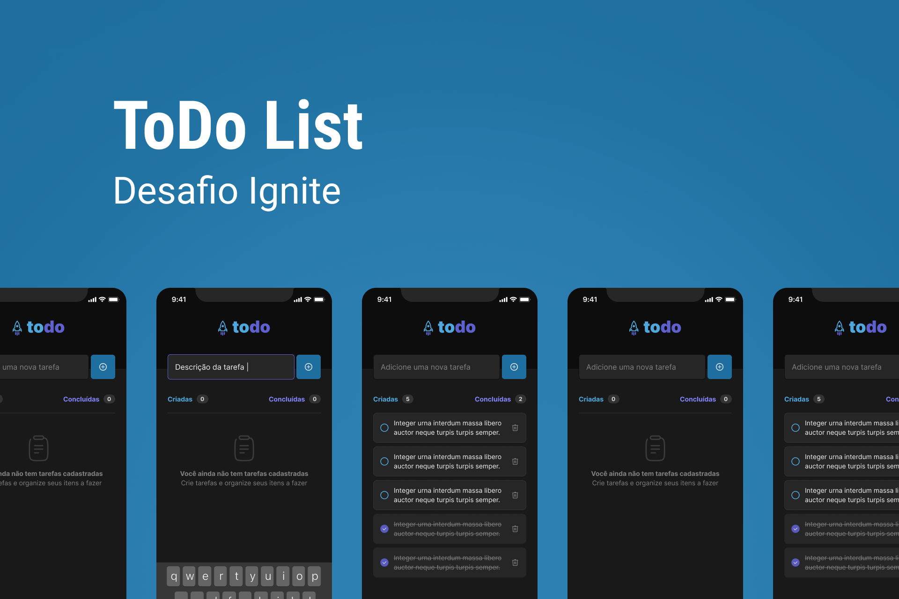

# Todo

<h1 align="center">
  
</h1>

> Projeto desenvolvido dentro do treinamento Ignite da Rocketseat. Todo o código foi desenvolvido por mim a partir de prtótipo do [Figma](https://www.figma.com/file/FvrYHN30Mq6nPwEu8NuipY/ToDo-List-(Copy)?node-id=56%3A96&t=39ADfnyg5Km9SJKi-0) e entregue como desafio na plataforma. A ideia do aplicativo é ser uma lista de tarefas a serem gerenciadas.  

## 💻 Pré-requisitos

Antes de começar, verifique se você atendeu aos seguintes requisitos:
* Você tem uma máquina `<Windows / Linux / Mac>`.
* Você tem o [git](https://git-scm.com) instalado na sua máquina.
* Você tem o [node](https://nodejs.org/en/) instalado na sua máquina.
* Você tem algum `emulador` instalado na sua máquina ou `device físico` com o aplicativo `Expo Go` instalado.

## 🚀 Instalando Todo

Para instalar o Todo, siga estas etapas:

bash:
```
# Clone este repositório
$ git clone <https://github.com/caiohbfurtado/todo>
# Acesse a pasta do projeto no terminal/cmd
$ cd todo
# Instale as dependências
$ npm install ou yarn install
```

## ☕ Usando Todo

Para usar Todo, siga estas etapas:

bash:
```
# Acesse a pasta do projeto no terminal/cmd
$ cd todo
# Execute a aplicação em modo de desenvolvimento
$ expo start
# O servidor inciará na porta:19000
# Você poderá inicializar a aplicação pressionando a para Android, i para iOS ou lendo o QR Code com seu device físico
```

### 🛠 Tecnologias

As seguintes ferramentas foram usadas na construção do projeto:

- [Expo](https://expo.io/)
- [React Native](https://reactnative.dev/)
- [TypeScript](https://www.typescriptlang.org/)


### 👨🏾‍💻 Autor
---

 

Feito com ❤️ por Caio Furtado 👋🏽 Entre em contato!

[](https://www.linkedin.com/in/caiohbfurtado/) 
[](mailto:caiohbfurtado@gmail.com)
